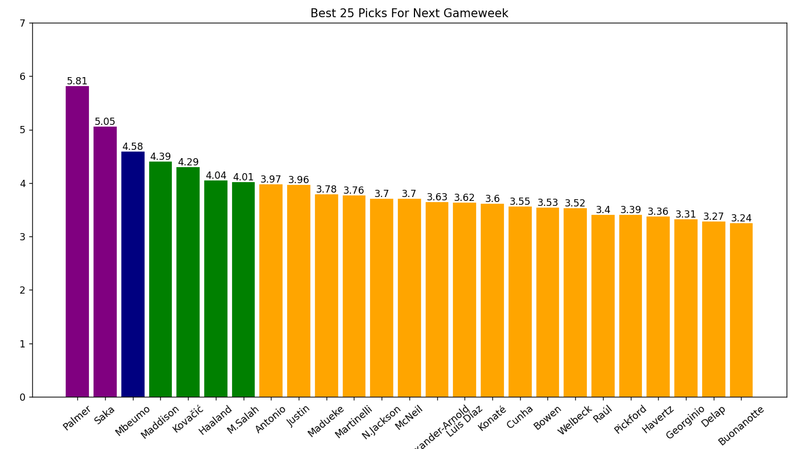

# FPL-Scraper

## Overview
**The Fantasy Premier League (FPL) Scraper** is a **`Python-based`** tool designed to assist Fantasy Premier League managers in making informed decisions about player selection. By **`Scraping`** real-time data from the FPL Form website using **`Selenium`**, this tool evaluates players based on various key metrics, such as Points Per Game, ICT Index, Form, and more.

The script normalizes the scores for each player across these metrics, allowing for a comprehensive comparison and ranking of players. This enables FPL managers to identify top performers and optimize their team selections. The results are presented in a visually appealing bar chart, with data labels and color coding to highlight performance levels using **`Matplotlib`**.

## Skills Demonstrated
* **Web Scraping:** Utilizes **`Selenium`** to extract live player data from the FPL Form website.
* **Data Wrangling:** Demonstrates proficiency in manipulating scraped data using **`Python`** 
* **Data Analysis:** Normalizes and calculates scores for players based on various performance metrics.
* **Data Visualization:** Implements **`Matplotlib`** to create informative bar charts that display player rankings.
  
## Features
* Scrapes player performance data from the FPL Form website.
* Calculates the minimum and maximum score for each filter to be able to normalize a score later on.
* Scrape each FPL player score across the filters.
* Calculates a comprehensive final score for each player based on multiple filters.
* Ranks players based on their normalized scores.
* The ability to export all players final score into an Excel Sheet.
* Visualizes the results using bar charts with data labels.
* Color-coded bars to indicate performance levels (high, medium, low).

## Usage
**1) Clone the Repository:**
```git clone https://github.com/yourusername/FPL-Player-Score-Analyzer.git```

**2) Install Required Packages:** Ensure you have Python installed, then install the required packages using pip:

``` pip install selenium matplotlib```

**3) Set Up WebDriver:**
   - Download the Chrome WebDriver from [Here](https://sites.google.com/chromium.org/driver/downloads?authuser=0) and place it in your desired directory.
   - Update the driver_path variable in the code to point to your WebDriver executable.

**4) Run the Script:** wait a little bit for the script to scrape all the data.

**5) View Results:** After running the script, a bar chart displaying player scores will be generated. The chart includes data labels and color-coded bars for easy analysis like this.




## Contact
For any inquiries or feedback, please reach out to zakoutkhalil@gmail.com

